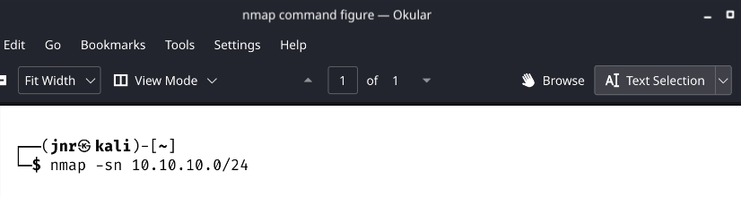

# Internal Network Penetration Test

## FOR VIRTUAL INFOSEC AFRICA

### SUBMITTED BY :ADJABENG DIVINE EDEM JUNIOR.

#

# Table of Contents

1. [Executive Summary]()
  
2. [Analysis of Overall Security Posture]()
  
3. [Key Recommendations]()
  
4. [Testing Methodology]()
  
5. [Summary of Findings]()
  
6. [Detailed Findings]()
  
  * Host Discovery
    
  * Service Discovery and Port Scanning
    
  * Vulnerability Scanning
    
  * Web-Based Attack Surfaces
    
  * Generating Payloads
    

---

### Executive Summary

VirtualInfosecAfrica conducted an internal network penetration test of the 10.10.10.0/24 network domain from September 12, 2024. The purpose of this test was to identify and assess security vulnerabilities within the internal network environment. This report provides a comprehensive overview of the methodologies and tools used to assess host discovery, service discovery, port scanning, and vulnerability identification.

During the engagement, hosts and active services were identified using tools such as Nmap for network scanning and Metasploit for vulnerability exploitation. Host discovery revealed 15 active hosts, followed by service enumeration, which highlighted multiple services including HTTP, MySQL, RDP, VNC, and Apache web servers across the network.

Service-specific vulnerabilities were identified using resources such as Exploitdb and MITRE CVE databases. Potential high-risk issues include unsecured remote access protocols (e.g., RDP and VNC), outdated MySQL databases, and Apache servers, all of which could be exploited to compromise the internal network.

The report also demonstrates the exploitation potential of these vulnerabilities using payload generation techniques with `msfvenom` for Apache Tomcat and Python servers, simulating scenarios where attackers could gain access through unpatched vulnerabilities.

This test uncovered various security weaknesses that could allow attackers to infiltrate the network and escalate their privileges, making it imperative for VirtualInfosecAfrica to implement corrective measures, including patch management, enhanced access controls, and vulnerability remediation.

### Overall Security Posture

The overall risk to the internal network is **HIGH**, primarily due to weak password policies, local administrator rights on multiple hosts, and exposed services like **Apache, MySQL, VNC,** and **RDP**. These vulnerabilities make it easier for attackers to move laterally through the network and escalate privileges to domain administrator, gaining access to sensitive business and customer data.

Externally, the risk is also **HIGH** because of the lack of multifactor authentication (MFA) on VPN access, making the network vulnerable to credential reuse attacks. Although no VPN access was gained from leaked employee passwords, the absence of MFA still poses a significant risk. The combination of these factors leaves the network highly vulnerable to internal and external attacks.

### Testing Methodology

The testing process began by using industry-standard vulnerability scanning tools, such as **Nessus Professional**, to identify live hosts and services on the in-scope IP addresses. The automated output was manually reviewed to identify missed vulnerabilities, followed by further manual enumeration to uncover additional weaknesses. The testers also used both automated tools and manual methods to identify default credentials across the network, and open-source intelligence (OSINT) was employed to find any exposed credentials on the internet.

With test user credentials, lateral movement was performed across the network. Testers discovered that all domain users had local administrator rights on multiple hosts, allowing them to escalate their privileges and capture domain administrator credentials. This access provided control over a significant portion of the network, including sensitive data stores and point-of-sale (POS) devices.

### DETAILED FINDINGS.
to discover the host of 10.10.10.0/24 ;i used the nmap command as shown below;

* I used Nmap because it efficiently identifies active devices on a network by scanning IP addresses and analyzing open ports. It also provides detailed information about the hosts' operating systems, services, and potential vulnerabilities, which is crucial for network security assessments.

* To filter my output and save them into a file ,I will use the "grep" command to extract the lines where hosts are marked as "Host is up" and save them into a UP hosts.txt file ;A demonstration is as follows;
  

